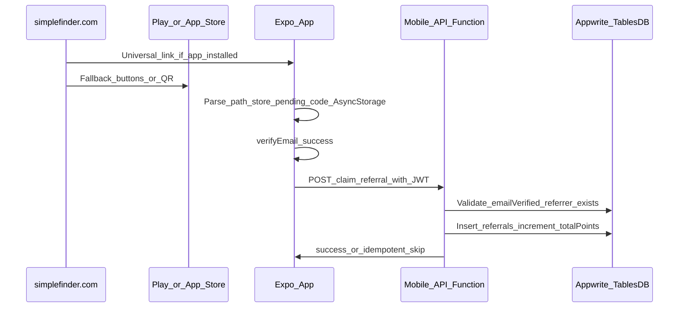

# Referral deep linking — specification and implementation

This document describes the referral URL flow, Appwrite data model, Mobile API endpoint, Expo client behavior, and static web assets for `simplefinder.com`.

## Goals

- **Share URL:** `https://simplefinder.com/referral/{referralCode}` using the short code on `user_profiles.referralCode`.
- **Referrer:** Profile “Refer a friend” uses the system share sheet with message + URL; point amounts come from the `settings` table.
- **Referee:** At most one referrer per user; points after **email verification** via `POST /claim-referral`.
- **Security:** Clients do not write referral rows; only the Mobile API Function with validated user context (`x-appwrite-user-id`).

## Architecture

## Appwrite

### Settings keys

| Key | Example value | Description |
|-----|----------------|-------------|
| `referral_points_referrer` | `100` | Points for the user who shared the link |
| `referral_points_referee` | `100` | Bonus for the new user |
| `referral_base_url` | `https://simplefinder.com` | Base URL for shared links (optional; app has default) |

### Table `referrals`

- Links referrer and referee profiles, stores snapshot points and status.
- Unique constraint on `refereeAuthID` ensures one referral per referee.

## Mobile API

- **Route:** `POST /claim-referral`
- **Body:** `{ "referralCode": "<code>" }`
- **Auth:** Execute with user JWT (`client.setJWT` + `functions.createExecution`) so `x-appwrite-user-id` is set.
- **Behavior:** Requires email verified; resolves referrer by `referralCode`; rejects self-referral, blocked users, invalid code; idempotent if referee already claimed.

## Expo app

- **`expo-linking`:** `getInitialURL` + `addEventListener('url')` → parse `/referral/{code}` → `AsyncStorage` key `pending_referral_code`.
- **`app.json`:** `scheme`, iOS `associatedDomains`, Android intent filters for `https://simplefinder.com/referral/*`.
- **Claim:** After successful `verifyEmail` in Confirm Account, and on login when email already verified and pending code exists (`src/lib/referralClaim.ts`).

## Web (`simplefinder.com`)

Static assets live in [`web/referral-landing/`](../web/referral-landing/README.md): landing HTML template, `apple-app-site-association`, and `assetlinks.json` **templates** (fill SHA-256, deploy to your host).

**Non-technical setup guide** (for whoever manages the domain, no code): [`REFERRAL_WEBSITE_SETUP_FOR_NON_DEVELOPERS.md`](./REFERRAL_WEBSITE_SETUP_FOR_NON_DEVELOPERS.md).

## Staging (optional)

Use a separate subdomain, bundle id, and/or Appwrite project so production links do not open dev builds.

## Testing

- Share sheet URL and dynamic points text.
- Cold/warm link → pending storage.
- Claim after verify → single credit; repeat → idempotent `already_claimed`.
- Invalid code / self-referral → error from API.
